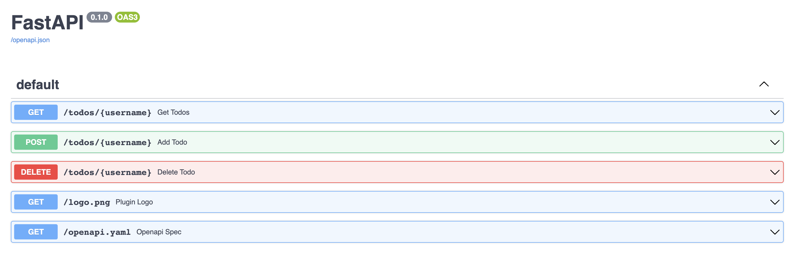

# [FastAPI] ChatGPT plugins quickstart

Get a todo list ChatGPT plugin up and running in minutes using Python y FastAPI. If you do not already have plugin developer access, please [join the waitlist](https://openai.com/waitlist/plugins).

## Setup

To install the required packages for this plugin, run the following command to create a virtual environment and install the packages:

```bash
python -m venv venv && source venv/bin/activate
```
```bash
pip install -r requirements.txt
```

To run the plugin, enter the following command:

```bash
uvicorn main:app --reload
```

Once the local server is running:

1. Navigate to https://chat.openai.com. 
2. In the Model drop down, select "Plugins" (note, if you don't see it there, you don't have access yet).
3. Select "Plugin store"
4. Select "Develop your own plugin"
5. Enter in `localhost:8000` since this is the URL the server is running on locally, then select "Find manifest file".

The plugin should now be installed and enabled! You can start with a question like "What is on my todo list" and then try adding something to it as well! 

## Using Swagger

You can access the API documentation and make queries using Swagger. Follow the steps below to get started:

1. Make sure you have the project running locally.
2. Open your web browser and visit [http://localhost:8000/docs](http://localhost:8000/docs).
3. On the Swagger page, you'll find an interactive interface that allows you to explore and test the different API routes and endpoints.



## Getting help

If you run into issues or have questions building a plugin, please join our [Developer community forum](https://community.openai.com/c/chat-plugins/20).
